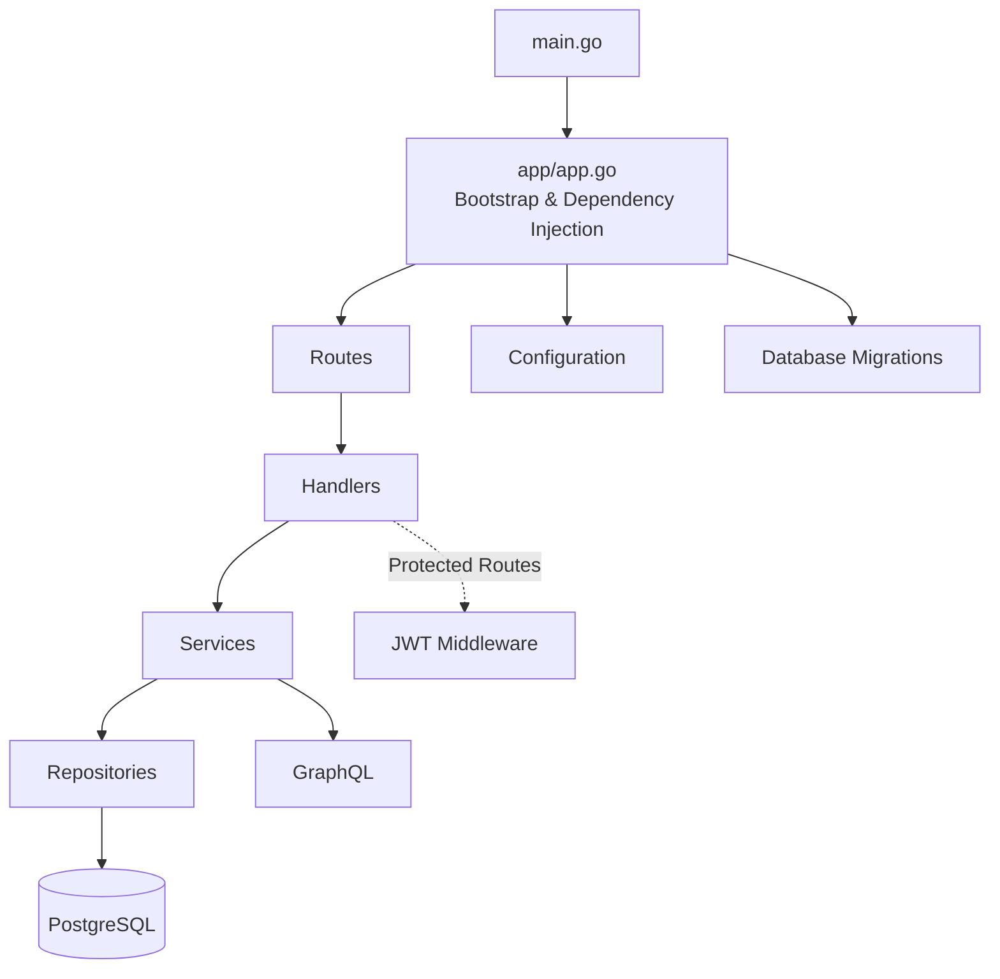

<h1 align="center">KalaSetu</h1>

<p align="center">
  A digital platform connecting traditional artists, craftspeople, organizers, sponsors, and audiences through employment and collaboration.
</p>

<p align="center">
  
  
  
  
  
  
</p>

---

# Overview

Traditional artists and craftspeople often struggle to find work, funding, and customers in a digital world dominated by generic social platforms. KalaSetu aims to bridge this gap by providing a dedicated digital ecosystem tailored to the cultural sector.

KalaSetu enables **Artists, Craftspeople, Organizers, Sponsors, and Audiences** to discover opportunities, collaborate, and build meaningful professional connections through a platform designed specifically for their needs.

This repository contains the complete KalaSetu project, including both the frontend and backend applications.

---

# Repository Structure

```
kalasetu/
├── kalasetu-backend/     # Go backend
└── kalasetu-frontend/    # Kotlin Multiplatform frontend
```

---

# Architecture

## Overall Repository

```text
                   KalaSetu
                      │
         ┌────────────┴────────────┐
         │                         │
         ▼                         ▼
 kalasetu-frontend          kalasetu-backend
 Kotlin Multiplatform          Go + Gin
```

## Backend Architecture

KalaSetu Backend follows a layered architecture that separates HTTP handling, business logic, and database access.



### Backend Layers

| Layer | Responsibility |
|--------|----------------|
| **Routes** | Maps HTTP endpoints to handler functions |
| **Handlers** | Handles HTTP requests and responses |
| **Services** | Implements business logic |
| **Repositories** | Performs database operations using raw SQL |

Supporting components include:

- JWT Authentication Middleware
- Embedded SQL Migrations
- GraphQL Schema & Resolvers
- Configuration Management

---

# Current Features

| Feature | Description |
|---------|-------------|
| **Authentication** | User registration and login using JWT authentication |
| **Refresh Tokens** | Secure refresh token rotation |
| **User Onboarding** | Collects profile information during onboarding |
| **Role Management** | Supports different user roles within the platform |
| **Application Submission** | Allows users to submit applications |
| **GraphQL Integration** | GraphQL server powered by gqlgen |


---

# Technology Stack

## Backend

| Component | Technology |
|-----------|------------|
| Language | Go |
| Framework | Gin |
| Database | PostgreSQL |
| Authentication | JWT |
| GraphQL | gqlgen |
| Containerization | Docker & Docker Compose |

## Frontend

| Component | Technology |
|-----------|------------|
| Language | Kotlin |
| Framework | Kotlin Multiplatform |
| Targets | Android, iOS |

---

# Getting Started

## Backend

### Prerequisites

- Docker
- Docker Compose

### Setup

Clone the repository:

```bash
git clone https://github.com/amfoss/kalasetu.git
cd kalasetu
```

Navigate to the backend:

```bash
cd kalasetu-backend
```

Configure the environment variables:

```bash
cp .env.example .env
```

Update the values in `.env` as required.

Build and start the backend services:

```bash
docker compose build
docker compose up
```

The backend automatically runs database migrations during startup.

### Backend tests

```bash
cd kalasetu-backend
make test
```

This starts a throwaway `postgres:16-alpine` container (Docker, host networking), runs `go test -v ./...`, and removes the container. Each test gets its own freshly migrated database and drives the GraphQL API in-process via `testutil.NewHarness`.

To use your own Postgres instead, set `KALASETU_TEST_DATABASE_URL` to a URL for a role that can `CREATE DATABASE` and run `go test ./...`. Without it, database tests are skipped.

---

## Frontend

Navigate to the frontend project:

```bash
cd kalasetu-frontend
```

KalaSetu Frontend is built using **Kotlin Multiplatform**, targeting:

- Android
- iOS


Refer to the frontend documentation inside `kalasetu-frontend` for platform-specific build and run instructions.

---

# Development

## Backend Directory Structure

```
kalasetu-backend/
├── app/
├── config/
├── graph/
├── handlers/
├── middlewares/
├── migrations/
├── repos/
├── routes/
├── services/
└── main.go
```

---

# Contributing

We welcome contributions from the community.

1. Fork the repository.

2. Clone your fork.

```bash
git clone https://github.com/<your-username>/kalasetu.git
```

3. Create a feature branch.

```bash
git checkout -b feature/my-feature
```

4. Make your changes.

5. Commit using meaningful commit messages.

```
feat: add onboarding endpoint
fix: validate application payload
docs: improve setup guide
```

6. Push your branch.

```bash
git push origin feature/my-feature
```

7. Open a Pull Request with a clear description of your changes.

---

# License

KalaSetu is licensed under the **GNU Affero General Public License v3.0 (AGPL-3.0)**.

See the `LICENSE` file for more information.