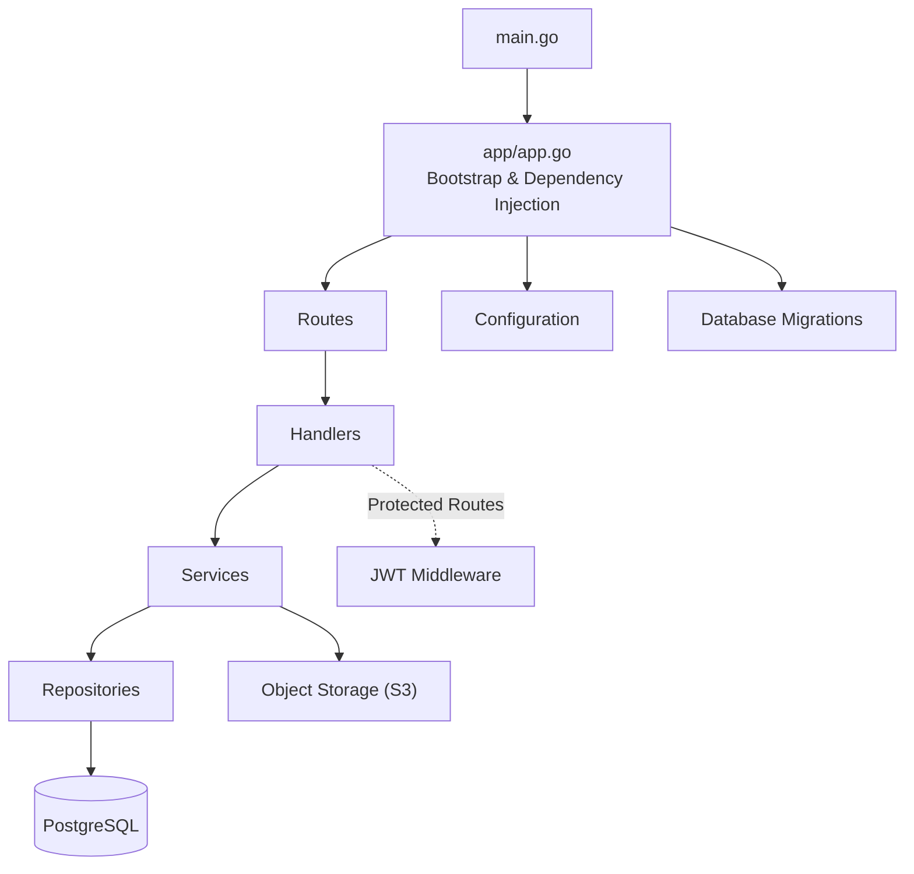

<h1 align="center">KalaSetu Backend</h1>

<p align="center">
  The Go + Gin server behind KalaSetu — a GraphQL API for the cultural and traditional arts sector.
</p>

<p align="center">
  
  
  
  
  
  
  
</p>

---

# Overview

The KalaSetu backend is a single GraphQL API that powers the whole platform. It is responsible for authentication, user onboarding, events, posts, comments, likes, applications, and profiles — while keeping photos and banners out of the database entirely by storing them in S3-compatible object storage.

The API is consumed by the KalaSetu frontend (`../kalasetu-frontend`), and by anyone else who wants to build against the platform.

---

# Repository Structure

```
kalasetu-backend/
├── main.go
├── app/
├── bruno/
├── config/
├── graph/
├── handlers/
├── middlewares/
├── migrations/
├── models/
├── repos/
├── routes/
├── services/
├── storage/
├── Dockerfile
├── go.mod
├── gqlgen.yml
└── tools.go
```

| Path | Purpose |
|------|---------|
| `main.go` | Entry point: wires the routed GraphQL endpoint to gqlgen and serves the playground |
| `app/` | Bootstraps the server and wires up all dependencies (the "composition root") |
| `bruno/` | Ready-made API request collection (Bruno) for quick manual testing |
| `config/` | Database and object-storage configuration loading |
| `graph/` | GraphQL schema, resolvers, and generated code |
| `handlers/` | HTTP handlers (currently authentication) |
| `middlewares/` | JWT authentication middleware |
| `migrations/` | Embedded SQL migrations, run automatically on startup |
| `models/` | Shared data structures and request/response types |
| `repos/` | Data-access layer using raw SQL |
| `routes/` | REST route registration |
| `services/` | Business logic |
| `storage/` | Object-storage abstraction backed by AWS S3 |

---

# Architecture

## High-Level Flow

```text
                   KalaSetu Frontend
          (Kotlin Multiplatform app)
                      │
              GraphQL over HTTP
                      │
                      ▼
        POST /api/v1/graphql  (Gin router)
                      │
         OptionalJWT middleware
                      │
                      ▼
      gqlgen GraphQL server (handlers/resolvers)
                      │
        ┌─────────────┼──────────────┐
        ▼             ▼              ▼
    Services      gqlgen        (file uploads)
   (business     resolvers
    logic)          │
        │      ┌────┴────┐
        ▼      ▼         ▼
  Repositories   PostgreSQL    S3 object storage
```

## Backend Layers

The backend follows a layered architecture that separates HTTP handling, business logic, and database access:



| Layer | Responsibility |
|--------|----------------|
| **Routes** | Maps HTTP endpoints to handler functions |
| **Handlers** | Handles REST HTTP requests and responses (auth) |
| **GraphQL layer** | Serves the GraphQL schema via gqlgen and resolves queries/mutations |
| **Services** | Implements business logic, validation, and media orchestration |
| **Repositories** | Performs database operations using raw SQL |
| **Storage** | Uploads, deletes, and resolves object URLs (S3) |

## GraphQL API

- **Endpoint:** `POST /api/v1/graphql`
- **Playground:** `GET /` — an interactive GraphQL playground
- **Transports:** `GET`, `POST`, and `MultipartForm` (for file uploads)
- **Schema:** lives in [`graph/schema.graphqls`](graph/schema.graphqls) — the single source of truth
- **Code generation:** gqlgen (`graph/generated.go`, `graph/model/*`) is regenerated from the schema

Authentication-aware resolvers read the user from the JWT middleware (`middlewares/`); anonymous requests are allowed to read public data.

## Object Storage

Post media (images/videos) and event banners are uploaded straight to S3 via GraphQL multipart file uploads. The database stores only a small object **key** plus metadata (content type, size). Public URLs are computed on read via `storage.GetURL`, so no image bytes or hardcoded links are ever persisted in PostgreSQL. Storage is optional — without AWS configuration the API still works, just without media.

## Authentication

- Registration, login, and refresh-token rotation live in `handlers/auth_handler.go` and `routes/`.
- Access tokens are validated by `middlewares.OptionalJWT()` before the GraphQL handler.
- User onboarding (`onboardUser`) collects name, role, location, labels, and bio.

## Database Migrations

Migrations are embedded Go files (`migrations/`) applied with `golang-migrate` on every startup, so the schema is always up to date when the server boots.

---

# Current Features

| Feature | Description |
|---------|-------------|
| **Authentication** | User registration and login using JWT authentication |
| **Refresh Tokens** | Secure refresh token rotation |
| **User Onboarding** | Collects profile information (role, location, labels, bio) |
| **Role Management** | Supports different user roles within the platform |
| **Events** | Create, update, delete, and list events, with optional banner upload |
| **Posts & Media** | Create, edit, delete posts with multi-media attachments |
| **Comments & Likes** | Engage with posts via comments and likes |
| **Applications** | Submit applications and track their status |
| **Profiles** | Public profile pages with followers, achievements, and recent posts |
| **GraphQL Integration** | Fully typed API powered by gqlgen |
| **Object Storage** | S3-backed media for posts and event banners |

---

# Technology Stack

| Component | Technology |
|-----------|------------|
| Language | Go |
| Framework | Gin |
| API | GraphQL (gqlgen) |
| Database | PostgreSQL |
| Authentication | JWT |
| Object Storage | AWS S3 (SDK v2) |
| Migrations | golang-migrate (embedded SQL) |
| Containerization | Docker & Docker Compose |

---

# Getting Started

## Prerequisites

- Docker
- Docker Compose
- Go 1.22+ (only needed for local development and code generation)

## Setup

Clone the repository:

```bash
git clone https://github.com/amfoss/kalasetu.git
cd kalasetu
```

Configure the environment variables:

```bash
cp .env.sample .env
```

Update the values in `.env` as required. Relevant variables:

| Variable | Purpose |
|----------|---------|
| `PORT` | HTTP port (default `8080`) |
| `DB_HOST`, `DB_PORT`, `DB_USER`, `DB_PASSWORD`, `DB_NAME`, `DB_SSLMODE` | PostgreSQL connection |
| `JWT_ACCESS_SECRET`, `JWT_REFRESH_SECRET` | JWT signing secrets |
| `AWS_REGION`, `AWS_BUCKET`, `AWS_ACCESS_KEY_ID`, `AWS_SECRET_ACCESS_KEY` | Object storage (optional; enables media uploads) |

Build and start the services:

```bash
docker compose up --build
```

- Database migrations run automatically during startup.
- GraphQL playground: <http://localhost:8080/>
- For a quick manual test, import the `bruno/` collection into [Bruno](https://www.usebruno.com/).

---

# Development

## Local Run (without Docker)

```bash
cd kalasetu-backend
go run .
```

The database connection is read from the environment (or `.env`); point `DB_HOST`/`DB_PORT` at your local PostgreSQL if running outside Docker.

## Directory Layout

```
kalasetu-backend/
├── main.go           # HTTP entry point (GraphQL + playground)
├── app/              # dependency injection & bootstrap
├── config/           # database & storage configuration
├── graph/            # GraphQL schema, resolvers, generated code
├── handlers/         # auth HTTP handlers
├── middlewares/      # JWT middleware
├── migrations/       # embedded SQL migrations
├── models/           # shared models and input types
├── repos/            # raw-SQL data access
├── routes/           # REST route registration
├── services/         # business logic
├── storage/          # S3 object storage abstraction
└── bruno/            # API request collection
```

## Regenerating the GraphQL Code

After editing `graph/schema.graphqls`:

```bash
go run github.com/99designs/gqlgen generate
```

## Adding a Migration

Add new `NNNNNN_name.up.sql` / `.down.sql` pairs in `migrations/`. They are embedded into the binary and applied automatically on startup.

---

# Contributing

We welcome contributions from the community.

1. Fork the repository.
2. Create a feature branch.
3. Make your changes, following the existing patterns and running `go build ./...` and `go vet ./...`.
4. Open a Pull Request with a clear description of your changes.

---

# License

KalaSetu is licensed under the **GNU Affero General Public License v3.0 (AGPL-3.0)**. See the `LICENSE` file for details.